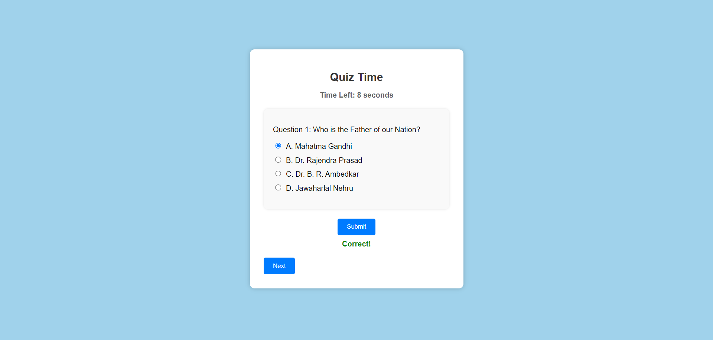
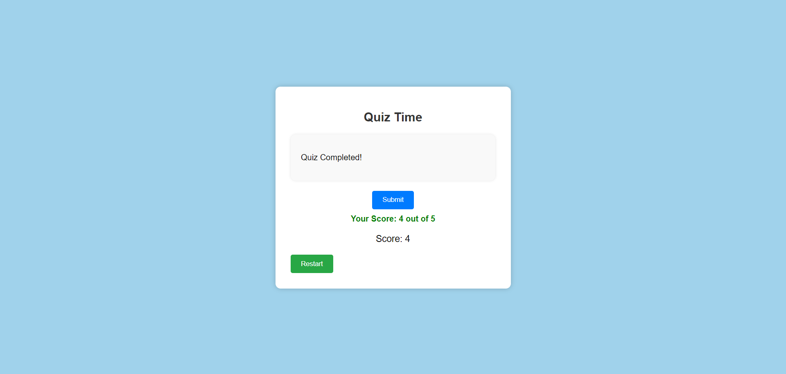

# Interactive Quiz

A simple interactive quiz web application built using HTML, CSS, and JavaScript.

## Table of Contents

- [Demo](#demo)
- [Features](#features)
- [Getting Started](#getting-started)
  - [Prerequisites](#prerequisites)
  - [Installation](#installation)
- [Usage](#usage)
- [Customization](#customization)
- [Contributing](#contributing)
- [License](#license)
- [Acknowledgments](#acknowledgments)

## Demo

You can see a live demo of the quiz here: [Demo Link](#)

## Features

- Multiple-choice questions with correct answers.
- Timer for each question.
- Interactive UI with animations.
- Score tracking.
- Restart option to retake the quiz.

## Getting Started

Follow these instructions to set up and run the quiz locally on your machine.

### Prerequisites

You need a web browser to run this quiz application.

